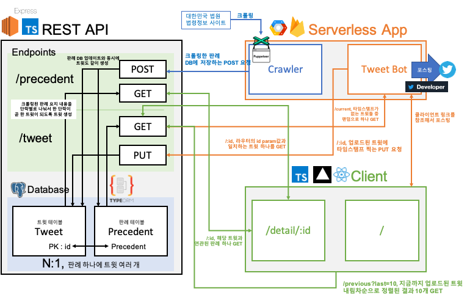

# 판례요지봇(precedent_bot)

###  🤖🐧👩🏻‍⚖️

 

트위터 판례요지봇 개인 프로젝트에 대한 문서입니다.  
프로젝트는 총 3개의 레포지토리로 이루어져 있고, 편의상 본 레포에 프로젝트에 관한 모든 내용을 모두 정리합니다.

- [트위터 계정 @precedent_bot](https://twitter.com/precedent_bot)
- [판례보기 웹앱](https://tweet-bot-client.vercel.app/)

## 🗂 Repo/Stack

### [1. supreme-court-API](https://github.com/MaxKim-J/supreme-court-API)

> 판례를 저장하는 DB와 REST API(현재 레포)

- [Express.js(+TypeScript)](https://github.com/expressjs/express)
- [TypeORM](https://github.com/typeorm/typeorm)
- [postgreSQL](https://www.postgresql.org/)
- [Jest](https://github.com/facebook/jest)
- [pm2](https://github.com/Unitech/pm2)
- AWS EC2
- AWS Route 53

### [2. supreme-court-serverless](https://github.com/MaxKim-J/supreme-court-severless)

> 판례 크롤러와 트윗봇은 firebase functions를 이용한 서버리스 아키텍쳐로 구현했습니다.

- [puppeteer](https://github.com/puppeteer/puppeteer)
- [node-twitter](https://github.com/jdub/node-twitter)
- firebase functions
- firebase realtime database
- google cloud platform scheduler

### [3. tweet-bot-client](https://github.com/MaxKim-J/tweet-bot-client)

> 판례요지를 보여주기 위한 React 앱웹입니다.

- [React.js(+TypeScript)](https://github.com/facebook/create-react-app)
- [React Router](https://github.com/ReactTraining/react-router)
- SCSS

## 📖  Key Note

### 주요 기능

- **트윗봇**은 트위터 계정을 통해 하루에 3번 대한민국 법원 법령정보 사이트에서 크롤링해온 판례요지 한 단락을 트윗합니다.
- **크롤러**는 법령정보 사이트를 주기적으로 관찰하여 판례의 개수가 늘어난 경우에 새로운 판례를 크롤링해서 **백엔드 서버**로 POST 요청, **DB**를 업데이트합니다.
- 판례요지 내용은 트위터로 트윗할 수 있는 최대 글자수를 넘기므로, 봇의 트윗에는 판례의 제목과 함게 판례요지 내용을 조회할 수 있는 **웹앱**의 링크를 같이 트윗합니다.

### 프로젝트 구조

### 스택, 구현 포인트

#### 서버

- TDD를 도입하여, jest를 이용해 테스트코드를 작성했습니다. 4개의 suite, 39개의 유닛 테스트를 통과했습니다.
- EC2에 직접 postgreSQL을 설치하여 배포했습니다. 무중단 서비스를 구현하기 위해 pm2도 사용했습니다.
- generic, @types, global, class 등 TypeScript의 다양한 기능을 사용했습니다.
- [이 포스팅](https://changhoi.github.io/posts/backend/serverside-typescript-setting-01/)을 참고하여 monolithic한 프로젝트 폴더 구조를 구축하려고 노력했습니다.
- 도메인을 구입하고 AWS에서 인증서를 발급받아 https를 적용했습니다.

#### 서버리스

- firebase functions로 서버리스 함수를 배포하고, GCP scheduler로 스케쥴링했습니다.
- Headless 브라우저 puppeteer을 사용해 서버리스 크롤링 봇을 구현했습니다.
- twitter developer API를 사용하여 백엔드에서 내용을 받아  트윗 봇을 구현했습니다.
- class 문법을 통해 각각의 서버리스 함수에 필요한 동작들과 자원들을 분리했습니다.

#### 클라이언트

- Create React App을 사용하여 빠르게 리액트 앱을 구축했습니다. 
- React.lazy, suspense를 사용하여 코드 스플리팅을 구현했습니다. 
- vercel을 이용해 배포했습니다.
- 트위터 포스팅에서 썸네일 등이 제대로 나타날 수 있도록 메타태그를 커스텀했습니다. 

### 앞으로 업데이트

- DB에 있는 판례 정보들을 구조화된 pdf로 내보낼 수 있는 서버리스 함수 추가(판례 내용을 책으로 만들기 위해)

## 📈 데이터 출처
[대한민국 법원 종합법률정보](https://glaw.scourt.go.kr/wsjo/intesrch/sjo022.do)